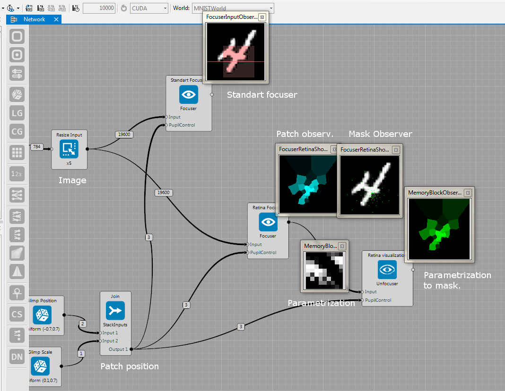

## Image Processing

These sample projects show several [examples](https://github.com/GoodAI/BrainSimulatorSampleProjects/tree/master/Vision) to perform [image processing](../guides/improc.md)

### Segmentation
Brain: [Vision/Vision_SLICsegmentation.brain](https://github.com/GoodAI/BrainSimulatorSampleProjects/blob/master/Vision/Vision_SLICsegmentation.brain)

The sample shows how to segment input image using the SLIC algorithm. Note that the input image is first re-sized to have a square shape, which is a requirement of the segmentation node. When one clicks on the observer, there is a `Operation/ObserverMode` property that yields to switch between different visualizations modes (such as segmentation borders, centers XYZ-color space etc.).

---

### Simple Image Pre-Processing

Brain: [Vision/Vision_segmentationForBreakout.brain](https://github.com/GoodAI/BrainSimulatorSampleProjects/blob/master/Vision/Vision_segmentationForBreakout.brain)

The sample project shows the pipeline for unsupervised discovery of the hypothesized objects. First, an input image is segmented into super-pixels (SP). Second, each SP is connected with its neighbors and close-by SP are assigned into a same object id. Third, the attention energy (Ea) is estimated for each object. Fourth, features are estimated as raw image patches. Fifth, the object features are clustered into a Visual Words to constitute a Working Memory.

Again, `Operation/ObserverMode` property of most of observers switches between visualization modes.

Details are described in [Guides/Image Processing](../guides/improc.md).

---

### Focuser
Brain: [Vision/focuserRetina.brain](https://github.com/GoodAI/BrainSimulatorSampleProjects/blob/master/Vision/focuserRetina.brain)

The brain file contains a simple example for cropping a part of the image. It shows the standart focuser that outputs a part of the image, given a position and scale.

In addition, the `Focuser` has a mode to work as retina transformation ([it is a modification of the method in this paper](http://papers.nips.cc/paper/4089-learning-to-combine-foveal-glimpses-with-a-third-order-boltzmann-machine.pdf)). In this case of retina transform, there is a higher resolution towards the given position, while the resolution decreases when being distant to the center.

---

### Sequential Drawing
Brain: [Vision/sequentialDrawing.brain](https://github.com/GoodAI/BrainSimulatorSampleProjects/blob/master/Vision/sequentialDrawing.brain)

In this sample project, the network in the middle takes raw image. Then, it gets the network's output until it gets the target and it can update. The example is provided with a small number of 10 MNIST images. More inspirations on how to use this architecture can be found at the [Marek's blog](http://blog.marekrosa.org/2015/09/another-goodai-milestone-attention_16.html).

