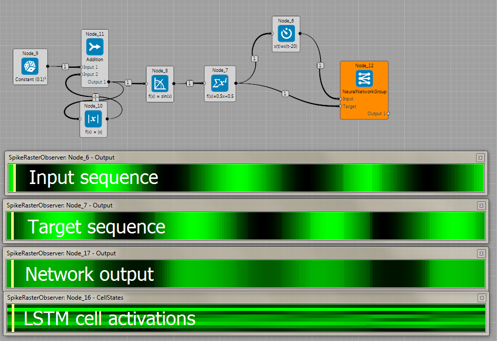
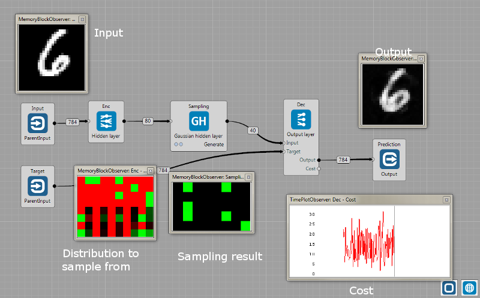
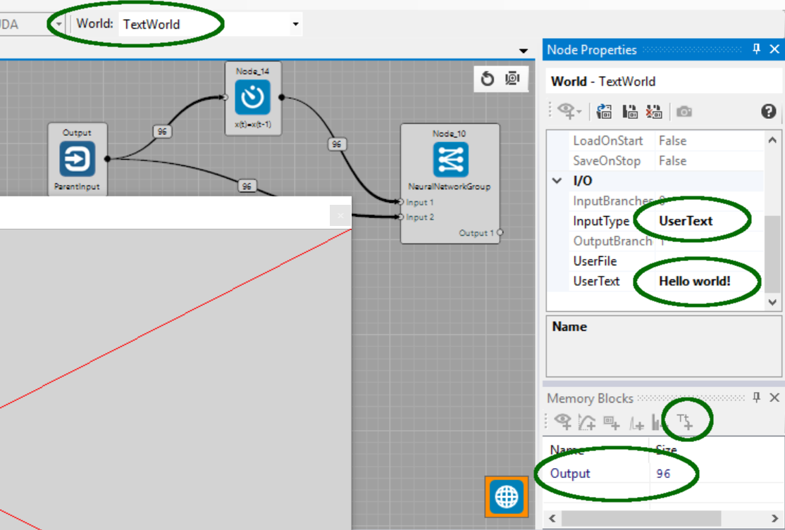
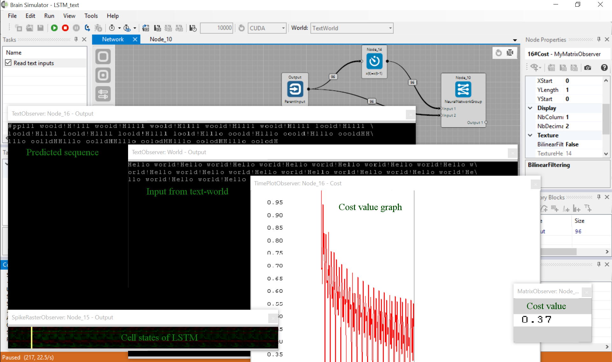
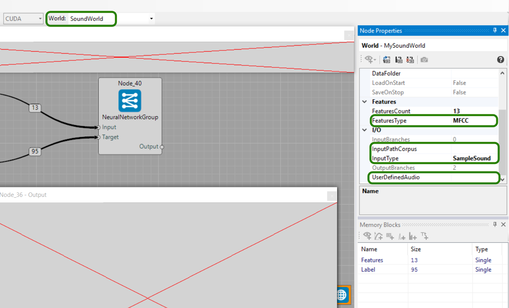
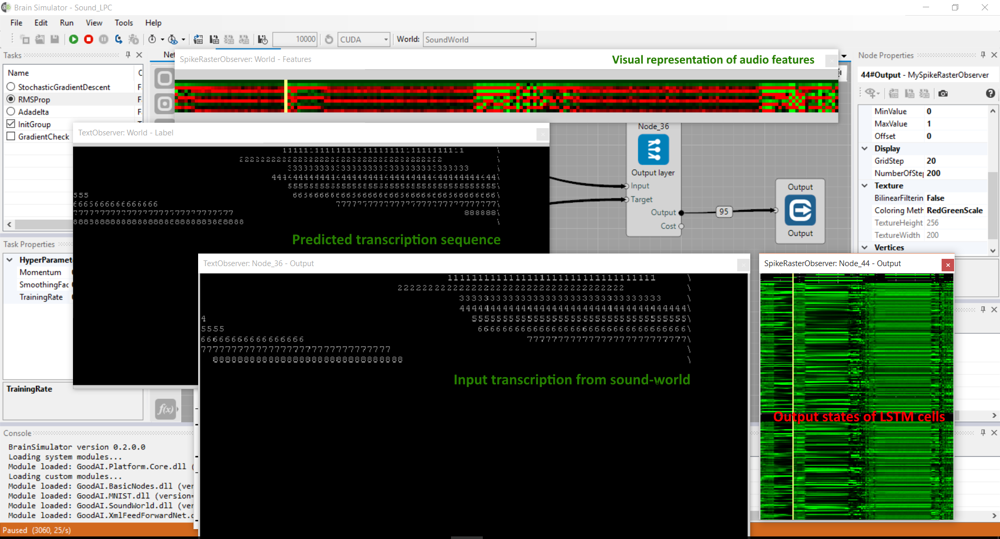
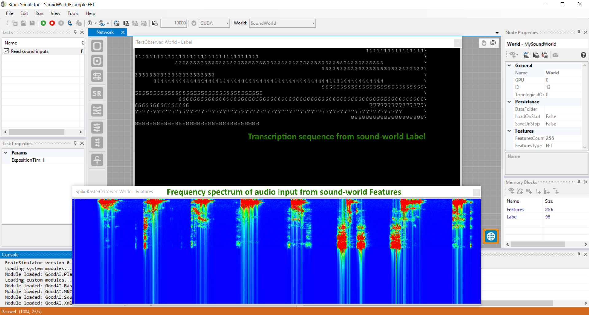

## Neural Network examples
[XOR gate](https://github.com/GoodAI/BrainSimulatorSampleProjects/blob/master/NeuralNetworks/Xor.brain) can be emulated by a feed forward Neural Network. This example shows the actual observed error. 

[MNIST database](https://github.com/GoodAI/BrainSimulatorSampleProjects/blob/master/NeuralNetworks/Mnist.brain) is a common testbed for Neural Networks. This example shows the moving average of the observed error. 

[Breakout](https://github.com/GoodAI/BrainSimulatorSampleProjects/blob/master/NeuralNetworks/Breakout.brain) based on Q-learning, a type of reinforcement learning. This example includes a gate between learned and random outputs.

[Recurrent network](https://github.com/GoodAI/BrainSimulatorSampleProjects/blob/master/NeuralNetworks/RNN_sine.brain) predicting sine wave 20 steps ahead.

[Long Short Term Memory](https://github.com/GoodAI/BrainSimulatorSampleProjects/blob/master/NeuralNetworks/LSTM_sine.brain) predicting sine wave 20 steps ahead.

[Variational AutoEncoder.](https://github.com/GoodAI/BrainSimulatorSampleProjects/blob/master/NeuralNetworks/VariGauss.brain) Guassian sampling node is between the encoder and decoder. If the output of the encoder has size $N$, first $N/2$ elements represents the mean ($\mu$) and second $N/2$ the variance ($\sigma$) that is the parametrization of a Gaussian distribution. Sampling node just sample from the distribution and this sampling is further used as the input to the decoder. See [1] for more details. The slider (outside the Group) turns off the training and the Gaussian node randomly generates samples.

[Learning Simple Text Sequence by LSTM](https://github.com/GoodAI/BrainSimulatorSampleProjects/blob/master/NeuralNetworks/LSTM_text.brain)
Learning a simple text sequence by LSTM neural network.
To use the TextWorld, in its properties set InputType:UserText and set UserText to "Hello world!".
We can add a text-observer to the world memory-block to see what characters the world generates.
Having selected the world's "Output 96 memory block" the text-observer can be added using the small icon with "Tt", see the following screenshot.

All is completely set in the provided brain file for you.
After executing it you can watch a repeated "Hello world!" sample from TextWorld and also LSTM prediction which should be more and more accurate over a short time period.
You can notice its error (cost) in the TimePlotObserver. See the next screenshot.
The text observers may not display the text properly. This error is caused by the simulation running too quickly, so please make sure that the report interval is set to 0 and consider slowing the simulation using the sleep interval (two stopwatch icons in the main Brain Simulator toolbar)

[Learning to recognize spoken digits using LSTM](https://github.com/GoodAI/BrainSimulatorSampleProjects/blob/master/NeuralNetworks/Sound_LPC.brain)
Learning the neural network to recognize spoken digits using speech audio features and LSTM. In order to use SoundWorld audio features, select Features type: MFCC (Mel-frequency cepstral coeficients) or LPC (Linear predictive cepstral coeficients). It's possible to add text-observer to the Label and Output memory blocks to see the input and learned transcription for currently used Feature. To define propper input, select Input type: SampleSound (english spoken digits 1-9 with transcription) or define path to your custom audio file in User defined audio or path to the whole audio corpus in Input path corpus.

Two complete examples are provided for you. [One for presentation of usage of LPC features](https://github.com/GoodAI/BrainSimulatorSampleProjects/blob/master/NeuralNetworks/Sound_MFCC.brain) and [another for use of MFCC features](https://github.com/GoodAI/BrainSimulatorSampleProjects/blob/master/NeuralNetworks/Sound_LPC.brain). Both are very similar. After executing you can see visual representation of features using spike-observer and transcription of digit in text-observer. Second text-observer shows actual transcription output of network, that predicts what digit is being presented to the input.

It is also possible to work with raw audio samples (Samples) or frequency spectrum (FFT) as shown in the [Sound_FFT](https://github.com/GoodAI/BrainSimulatorSampleProjects/blob/master/NeuralNetworks/Sound_FTT.brain) example.

### References
 [1] [Diederik P Kingma, Max Welling. Auto-Encoding Variational Bayes](http://arxiv.org/abs/1312.6114)
