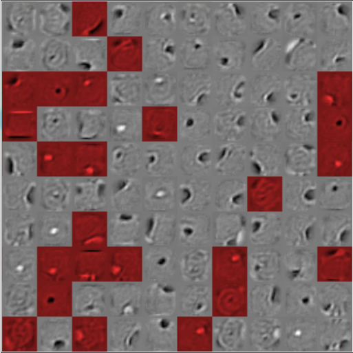

## RBM MNIST example

This is a working example of a simple two-layer RBM (i.e. not a [DBN](https://en.wikipedia.org/wiki/Deep_belief_network)) trained on the full [MNIST dataset](http://yann.lecun.com/exdb/mnist/) (60000 images).

Brain file: [RBM_MNIST.brain](https://github.com/GoodAI/BrainSimulatorSampleProjects/blob/master/RBM/RBM_MNIST.brain)

Make sure you also have the [saved state](https://github.com/GoodAI/BrainSimulatorSampleProjects/tree/master/RBM "mnist.state file and mnist.statedata folder") available if you'd like to see the pretrained version.

**For introduction to RBMs, see the [RBM guide](../guides/rbm.md) entry first.**

---
### Setting parameters

After opening the brain file, double-click the RBM group to see its contents.

When inside the group, you can select its layers. You can also select the whole group without leaving it – click the square button in lower-right corner:

This allows you to access all parameters of group as well as the layers.

Some parameters are layer-specific, such as dropout rate; some are common for the whole group. Refer to the [parameter section](../guides/rbm.md#parameters) of the RBM guide for their description and recommendations.

---
### Saving and loading states

You can select whether you'd like to train the RBM from scratch or use the pretrained version by disabling or enabling the load button for both layers (separately):

The brain file preserves the location save relatively to its position so the loading should work even if the specified path (orange rectangle in the image above) is not correct for your machine.

Nevertheless, should you want to load a different state file, change the path to the saved memory blocks for each node. See the [Persistence guide](../guides/persistence.md) for details.

---
### Visualizing the filters

The process of visualizing the filters while training is underway is one of the biggest advantages of this implementation.

Filters are thoroughly described and explained in the [RBM guide](../guides/rbm.md#filters).

Below is an example of RBM trained on MNIST for 10 epoch (i.e. 600000 iterations):

