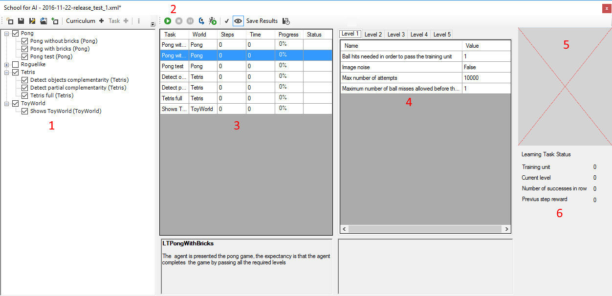

## School for AI

This section shows usage of School for AI (or School for short) in Brain Simulator.
School for AI makes it easy to specify the environments that the agent will interact with. 

### UI

To use the School, start Brain Simulator and select "View->School for AI". Notice that this action will change your current world to School World and open a dedicated School window (see illustration below).   

The School window allows you to:

1. Specify the curriculum which your agent will be subjected to
2. Control the simulation
3. See what problem (learning task) is being run at the moment
4. See the current state of progression of a learning task
5. See what kind of input data your agent is receiving
6. See runtime statistics

### Basic concepts

The Agent is expected to experience different environments, each having different rules, School for AI makes this process easier by allowing the user to select, from the user interface, the environments and the order in which those environments appear.

#### School

The agent can be seen as attending a virtual school, where different types of exercises are presented to the Agent in order to teach it skills, in "School for AI", those exercises are referred to as "Learning Tasks". A learning task, for example, might have the purpose of teaching to the Agent the detection of shapes, this process would involve presenting different shapes to the Agent on different instances, those specific instances are referred to as "Training Units", a Learning Task consists of one or more Training Units. Lastly, a list of learning tasks compose what is referred to as "Curriculum".

#### Learning Task

A Learning Task can be seen as an exercise that is presented to the Agent in order to teach it to solve a specific type of problem

#### Training Unit

A Training Unit is a specific instance of the problem that a Learning Task represents and wants to teach the Agent to solve.

#### Curriculum

A curriculum is a composition of one or more Learning Tasks

### Architecture overview

#### School World

#### World Adapters

#### Switching Worlds

