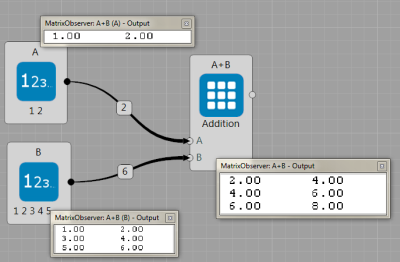

# Matrix node

Purpose of this node is to simplify vanilla matrix operations such as addition or multiplication.

## List of features

 * The node allows multiplication or addition with different input sizes, so in addition to to matrix multiplication
$\mathbf{A} \cdot \mathbf{B}$ (where $\mathbf{A}$,$\mathbf{B}$ are matrices), it directly supports $\mathbf{v}^{\mathsf{T}} \cdot \mathbf{A}$ ($\mathbf{v}$ is vector), or $\mathbf{A} \cdot \mathbf{v}$, $\mathbf{v}^{\mathsf{T}} \cdot \mathbf{w}$, $\mathbf{v} \cdot \mathbf{w}^{\mathsf{T}}$, or $ c \cdot \mathbf{A}$.
 * For several opts (getRow, $c \cdot \mathbf{A}$), two input types are supported: 1) a memory block from another node; 2) user writes number in `ExecuteParams/DataInput` task property.
 * The node is a layer above the `MatrixAutoOps` class, so you can use it in your code.


## Operations

 * **Addition,Multiplication,Substraction,MultiplElemntWise** (two memBlock inputs, or one into A and set the DataInput0 parameter): If two inputs each of them can be matrix, or vector, or constant). Be careful about the correct sizes/dimensions of the inputs, it does column/row-wise operation. If only input to the A, then it performs multiplication with the value at DataInput.
 * **DotProd** (two memBlock inputs): performs $\\mathbf{v}^{\mathsf{T}} \cdot \mathbf{w}$. Again, be careful about the dimensions of your inputs.
 * **MinIndex, MaxIndex** (one mem block input): returns min/max index in the vector.
 * **GetCol,GetRow** (two memBlock inputs, or one into A and set the DataInput0 parameter): returns n-th column of the input. The n that defines column/row id can be DataInput0 or value in the memory block in the B-input.
 * **Minus** (one memBlock input): returns minus input block
 * **Normalize ** (one memBlock input): return normalized matrix A, Norm2 used in this case.
 * **Norm2** (one memBlock input): returns norm2 of the matrix A
 * **Exp, Abs, Log, Round, Floor, Ceil** (one memBlock input): returns Exp/Log/Abs/Floor/Round/Ceil of each element of the matrix A.


## Using as a node in Brain Simulator


Here are few representative examples how to use Matrix node, more can be found in the Sample Projects, where you can play with parameters and copy-past nodes directly into your projects.

* Two memory blocks that represents matrices are multiplied, below observers show what is inside the memory blocks.


* Two memory blocks that represents a matrix and a vector are multiplied, below observers again show what is inside the memory blocks.


* Two memory blocks that respresents a matrix and a vector are summed. The algorithm cannot perform element-wise addition because of the memory block sizes, but the number of columns of the matrix and the vector correspond. Thus the algorithm performs element-wise addition for each row.



* The matrix node allows user to insert the constant as DataInput0 (see orange circle) and the values in the memory block A will be increase by it, as shown in figure below. Note that if you will choose 


## Using it in your C# code

You need create the Matrix object
``` csharp
MyMatrixAutoOps mat_operation;
```

In the `Init` part, it is necassary to create an instance of the object and set-up the desired operations:
``` csharp
mat_operation = new MyMatrixAutoOps(Owner, Matrix.MatOperation.Multiplication | Matrix.MatOperation.Addition, A);
```

Inside details such as cublas, CPU, or kernels are hidden. So, you can directly multiply memory blocks `A` and `B` and save the result into memory the block `C`,
``` csharp
mat_operation.Run(Matrix.MatOperation.Multiplication, A, B, C);
```
or multiply `A` with number 10.4,

``` csharp
mat_operation.Run(Matrix.MatOperation.Multiplication, A, 10.4f, C);
```

Becuase the `Addition` operation was initlized too, the user can proceed,
``` csharp
mat_operation.Run(Matrix.MatOperation.Addition, A, B, C);
```

Complete code in the Brain Simulator node will look like:
``` csharp
public class MyExecuteTask : MyTask<MyNode>
{
  private MyMatrixAutoOps mat_operation;

  public override void Init(int nGPU)
  {
    mat_operation = new MyMatrixAutoOps(Owner, Matrix.MatOperation.Multiplication | Matrix.MatOperation.Addition, Owner.A);
  }
  public override void Execute()
  {
    mat_operation.Run(Matrix.MatOperation.Multiplication, Owner.A, Owner.B, Owner.C);
    mat_operation.Run(Matrix.MatOperation.Multiplication, Owner.C, 10.3f, Owner.B);
    mat_operation.Run(Matrix.MatOperation.Addition, Owner.A, Owner.B, Owner.C);  // C = A+A*B*10.3
  }
}
```

