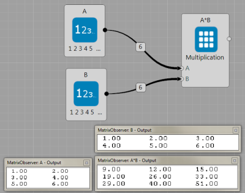
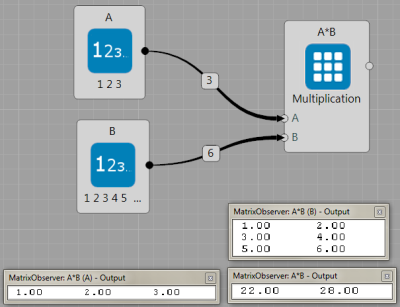

# Matrix node

Purpose of this node is to simplify vanilla matrix operations such as addition or multiplication.

## List of features

 * The node allows a number of operations (like multiplication or addition) with a variety of inputs. For example matrix multiplication ($\mathbf{A} \cdot \mathbf{B}$, where $\mathbf{A}$,$\mathbf{B}$ are matrices), vector times matrix ($\mathbf{v}^{\mathsf{T}} \cdot \mathbf{A}$, where $\mathbf{v}$ is a vector), multiplication where inputs are vectors, ($\mathbf{w}^{\mathsf{T}} \cdot \mathbf{v}$, $\mathbf{v} \cdot \mathbf{w}^{\mathsf{T}}$), or operations with numbers like $ c \cdot \mathbf{A}$ and much more.
 * Two input types are supported for several operations: 1) a memory block from another node; 2) a number in the task property `ExecuteParams/DataInput`.
 * The Matrix Node is a layer above the `MatrixAutoOps` class, so you can use it in your code as well.


## Operations

The node is always expected that one input as a Memory Block (MB) goes to **A** and, if second input is required, the second one goes to **B**, or it is optionally a number.

 | Operation | Input  | Comment |
 | - | -  | - |
 | **Multiplication**<br> $\mathbf A \cdot \mathbf B$      | Two MB | Each input can be a matrix, vector, or number. |
 | **Multiplication**<br> $\mathbf A \cdot$`DataInput0`    | One MB + `DataInput0`  | MB input that goes into $\mathbf A$ can be matrix, vector, or number.  |
 | **Addition**<br> $\mathbf A + \mathbf B$                | Two MB  | Each input can matrix, vector, or number. If matrix/vector used as input, the node performs row/column-wise addition. |
 | **Addition**<br> $\mathbf A +$ `DataInput0`              | One MB + `DataInput0`  | MB input that goes into $\mathbf A$ can be matrix, vector, or number.  |
 | **Substraction**<br> $\mathbf A - \mathbf B$            | Two MB  | Each input can matrix, vector, or number. If matrix/vector used as input, the node performs row/column-wise addition. |
 | **Substraction** <br> $\mathbf A -$ `DataInput0`         | One MB + `DataInput0`  | MB input that goes into $\mathbf A$ can be matrix, vector, or number. The operation performs $\mathbf A$-'DataInput0'.  |
 | **MultiplElemntWise**<br> $\mathbf A \circ \mathbf B$   | Two MB  | Element-wise product, each input can matrix, vector, or number. |
 | **DotProd**<br> $\mathbf A^{\mathsf T} \cdot \mathbf B$ | Two MB | Each input is a vector. This operation can be additionally performed by the **Multiplication** operation. |
 | **MinIndex**<br> $\underset{i}{\textrm{arg min}} ~\mathbf A_i$      | One MB |  Returns the index of the min value in the vector. |
 | **MaxIndex**<br> $\underset{i}{\textrm{arg max}} ~\mathbf A_i$      | One MB |  Returns the index of the max value in the vector. |
 | **GetCol**<br> $ \mathbf A_{i,:}$                       | Two MB |  First MB input is matrix, second input is number that defines the column to get (first one has index 0). |
 | **GetCol**<br> $ \mathbf A_{i,:}$                       | One MB + `DataInput0` |  MB input is matrix,  `DataInput0` defines the column to get (first one has index 0). |
 | **GetRow**<br> $ \mathbf A_{:,i}$                       | Two MB |  First MB input is matrix, second input is number that defines the row to get (first one has index 0). |
 | **GetRow**<br> $ \mathbf A_{:,i}$                       | One MB + `DataInput0` |  MB input is matrix,  `DataInput0` defines the row to get (first one has index 0). |
 | **Minus**<br>  $ -\mathbf A$                            | One MB |  MB input is matrix. |
 | **Norm2**<br>  $ \Vert \mathbf A \Vert_2 $              | One MB |  Returns Norm2 of the input MB. |
 | **Normalize**<br>  $ \frac{1}{\Vert \mathbf A \Vert_2} \mathbf A$   | One MB |  Normalizes the input MB. |
 | **Exp, Log, Abs, Round, Flooe, Ceil**                   | One MB |  Performs the desired operation on each element in the input MB. |
 |


## Using as a node in Brain Simulator


Here are few representative examples how to use Matrix node, more can be found in the [Sample Projects](..\examples.md), where you can play with parameters and copy-past nodes directly into your projects.


---

**Multiplication of two matrices**

Two memory blocks that represents matrices are multiplied, below observers show what is inside the memory blocks.



---

**Multiplication of vector with a matrix**

Two memory blocks that represents a matrix and a vector are multiplied, below observers again show what is inside the memory blocks.




---

**Row-wise addition of matrix with a vector**

Two memory blocks that represents a matrix and a vector are summed. The algorithm cannot perform element-wise addition because of the memory block sizes, but the number of columns of the matrix and the vector correspond. Thus the algorithm performs element-wise addition for each row.


---

**Addition of a matrix with a constant number**

The matrix node allows user to insert the constant as DataInput0 (see orange circle) and the values in the memory block A will be increase by it, as shown in figure below. Note that if you will choose 


## Using Matrix operations in C# code

You need create the Matrix object
``` csharp
MyMatrixAutoOps mat_operation;
```

In the `Init` part, it is necassary to create an instance of the object and set-up the desired operations:
``` csharp
mat_operation = new MyMatrixAutoOps(Owner, Matrix.MatOperation.Multiplication | Matrix.MatOperation.Addition, A);
```

Inside details such as cublas, CPU, or kernels are hidden. So, you can directly multiply memory blocks `A` and `B` and save the result into memory the block `C`,
``` csharp
mat_operation.Run(Matrix.MatOperation.Multiplication, A, B, C);
```
or multiply `A` with number 10.4,

``` csharp
mat_operation.Run(Matrix.MatOperation.Multiplication, A, 10.4f, C);
```

Because the `Addition` operation was initialized too, the user can proceed,
``` csharp
mat_operation.Run(Matrix.MatOperation.Addition, A, B, C);
```

Complete code in the Brain Simulator node will look like:
``` csharp
public class MyExecuteTask : MyTask<MyNode>
{
  private MyMatrixAutoOps mat_operation;

  public override void Init(int nGPU)
  {
    mat_operation = new MyMatrixAutoOps(Owner, Matrix.MatOperation.Multiplication | Matrix.MatOperation.Addition, Owner.A);
  }
  public override void Execute()
  {
    mat_operation.Run(Matrix.MatOperation.Multiplication, Owner.A, Owner.B, Owner.C); // C = A*B
    mat_operation.Run(Matrix.MatOperation.Multiplication, Owner.C, 10.3f, Owner.B); // B = C*10.3 = A*B*10.3
    mat_operation.Run(Matrix.MatOperation.Addition, Owner.A, Owner.B, Owner.C);  // C = A+A*B*10.3
  }
}
```
