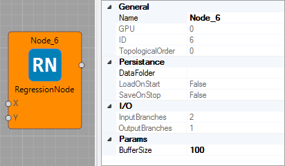
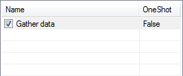
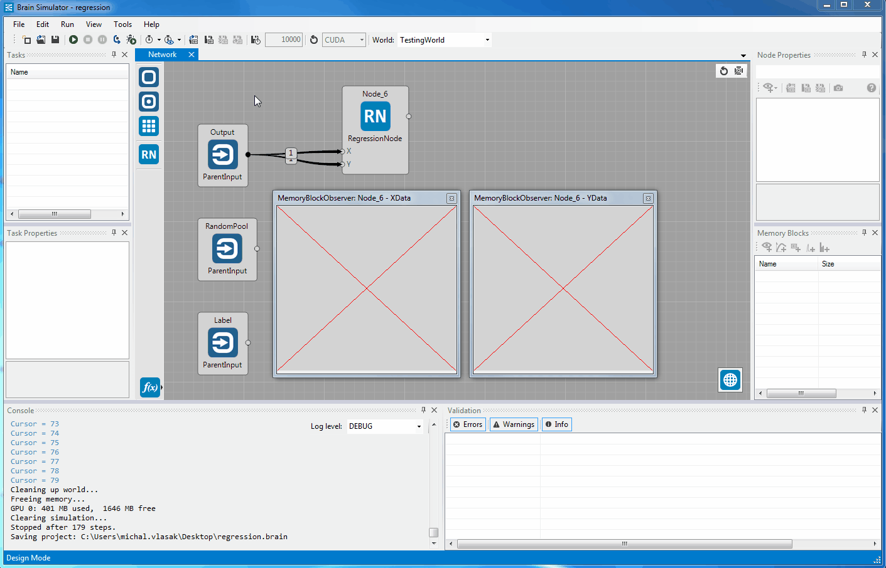
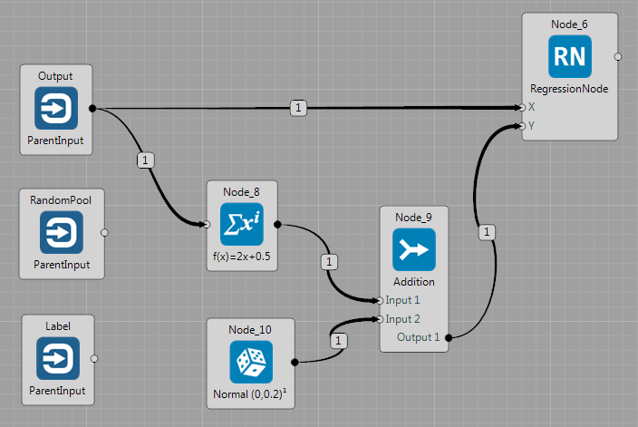
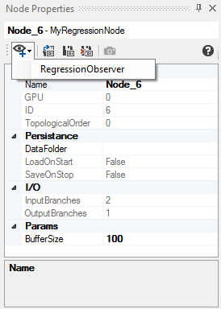
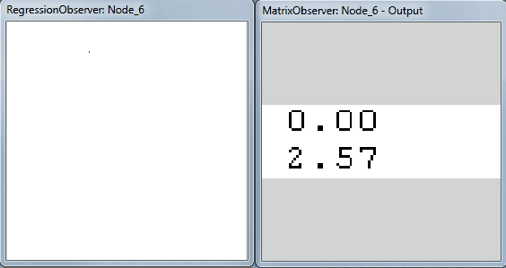
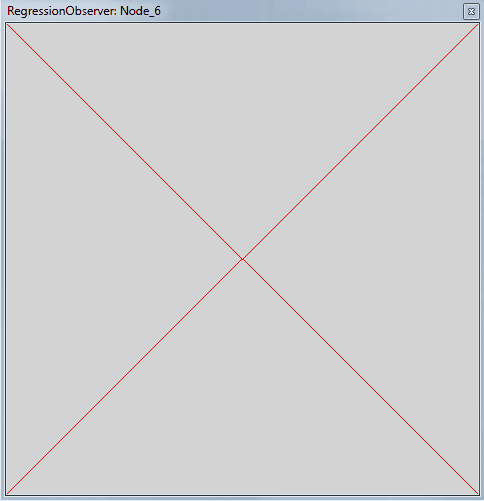

# How to create a module

In this tutorial, you will learn how to create a simple node with few tasks and add a custom observer to it.

For the purpose of this tutorial, we will implement a regression node, which will process last N served data.

## Clone a blank template

* From [GoodAI GitHub repository](https://github.com/GoodAI/BrainSimulatorNewModule), clone blank template project. It contains preconfigured Visual Studio project which you can use right away.
* Do NOT open solution in Visual studio!
* We need to give our module a meaningfull name. Lets assume the best name is "RegressionModule" from now on...
* In `Module` folder, rename `NewModule.csproj.user.template-RENAME_ME` to `NewModule.csproj.user`. This has to be done with Visual Studio not running. Now you can open the solution.
* Open `SampleNewModule` solution in Visual Studio.
* Rename solution to `RegressionModule` within the Visual Studio.
* In `NewModule -> Properties -> Application`; change `Assembly name` and `Default namespace` to `RegressionModule`.
* In `NewModule -> Properties -> Debug`; check the path to your Brain Simulator installation (`Start external program`) and an argument for loading your module on startup (`-m RegressionModule.dll`).
* Rename `NewModule` project to `RegressionModule` within the Visual Studio.
* Rename `NewModuleCuda` project to `RegressionModuleCuda`.
* Delete `SomeNode.cs` file from `RegressionModule` project and `SomeNode.cu` kernel file from `RegressionModuleCuda` project use these as templates and rename accordingly.

## Create Node

* Open the template project a create a new C# class **MyRegressionNode.cs**. Inside the file, you should have some basic structure already

``` csharp
using System;
using System.Collections.Generic;
using System.Linq;
using System.Text;
using System.Threading.Tasks;

namespace RegressionModule
{
    class MyRegressionNode
    {
    }
}
```

* To actually start implementing the node, your class have to be inherited from **MyWorkingNode** class, which is in **GoodAI.Core.Nodes** package.
* We need to implement abstract `UpdateMemoryBlocks` method
* As a best practice, we should also add some meta-info about the node. Add comment describing the author of the node and its simple description

``` csharp
using System;
using System.Collections.Generic;
using System.Linq;
using System.Text;
using System.Threading.Tasks;

using GoodAI.Core.Nodes;

namespace RegressionModule
{
    /// <author>GoodAI</author>
    /// <meta>mv</meta>
    /// <status>Work in progress</status>
    /// <summary>Regression node</summary>
    /// <description>Will perform online linear regression</description>
    class MyRegressionNode : MyWorkingNode
    {
        public override void UpdateMemoryBlocks()
        {

        }
    }
}
```

## Add Node to Brain Simulator

Node definition has to be added to *conf/nodes.xml*. After that, you can enable your node in View->Configure Node Selection (CTRL+L) view. Change *conf/nodes.xml* to:

``` xml
<?xml version="1.0" encoding="utf-8" ?>
<Configuration  RootNamespace="RegressionModule">
  <KnownNodes>
    <Node type="RegressionModule.MyRegressionNode" CanBeAdded="true" />
  </KnownNodes>
</Configuration>
```

After that, you can go to the Configure Node Selection view (CTRL+L) and your node should be there. After checking the checkbox, your node will appear in the [nodes toolstrip](../ui.md)

## Add Memory Blocks

* If we want to actually process some data, we have to add *input memory blocks*. We will add two of them. One for X values and one for Y values. **MyMemoryBlock** class is in **GoodAI.Core.Memory** namespace and **MyInputBlock** annotation in **GoodAI.Core.Utils** namespace, so include those packages too.

``` csharp
[MyInputBlock(0)]
public MyMemoryBlock<float> XInput
{
    get { return GetInput(0); }
}

[MyInputBlock(1)]
public MyMemoryBlock<float> YInput
{
    get { return GetInput(1); }
}
```

* We also need to present some results to users, so we will need an *output memory block* too.

``` csharp
[MyOutputBlock(0)]
public MyMemoryBlock<float> Output
{
    get { return GetOutput(0); }
    set { SetOutput(0, value); }
}
```

* Notice, that unlike *input block* which has only getter, *output block* has getter and setter too. That is because you **can't** set your input blocks, but you **have to** set your output blocks.
* We also need one memory block to store input data.

``` csharp
public MyMemoryBlock<float> XData { get; private set; }
public MyMemoryBlock<float> YData { get; private set; }
```

## Node Parameters
Now we should consider some parameters, which our node will need. We will need to define the size of data buffer. When this buffer is full and new data arrives, the oldest data will be overwritten.

The size of the buffer corresponds to the size of our data memory blocks. As this directly affects the size of memory block, this parameter has to be the *node parameter* (see [model](../model.md)).

Add this code to your node's definition

``` csharp
[MyBrowsable, Category("Params"), YAXSerializableField(DefaultValue = 100)]
public int BufferSize { get; set; }
```

If you want to add *Category* annotation, you need to include **System.ComponentModel** package. If you want this parameter to be serialized, you also need to include **YAXLib** package.

At this point, we can set the **BufferSize** parameter in the UI, but it does not affect memory block in any way. To fix this, and make our memory blocks usable, alter `UpdateMemoryBlocks` method in the following way.

``` csharp
public override void UpdateMemoryBlocks()
{
    XData.Count = BufferSize;
    YData.Count = BufferSize;
}
```

If we now drag our node to the workplace, we can see its inputs, outputs as well as node parameter.



By now, our node should look like this

``` csharp
namespace RegressionModule
{
    /// <author>GoodAI</author>
    /// <meta>mv</meta>
    /// <status>Work in progress</status>
    /// <summary>Regression node</summary>
    /// <description>Will perform online linear regression</description>
    class MyRegressionNode : MyWorkingNode
    {
        [MyInputBlock(0)]
        public MyMemoryBlock<float> XInput
        {
            get { return GetInput(0); }
        }

        [MyInputBlock(1)]
        public MyMemoryBlock<float> YInput
        {
            get { return GetInput(1); }
        }

        [MyOutputBlock(0)]
        public MyMemoryBlock<float> Output
        {
            get { return GetOutput(0); }
            set { SetOutput(0, value); }
        }

        public MyMemoryBlock<float> XData { get; private set; }
        public MyMemoryBlock<float> YData { get; private set; }

        [MyBrowsable, Category("Params"), YAXSerializableField(DefaultValue = 100)]
        public int BufferSize { get; set; }

        public override void UpdateMemoryBlocks()
        {
            XData.Count = BufferSize;
            YData.Count = BufferSize;
        }
    }
}
```

## Add Task
Main computation unit of nodes are **tasks**. We will add simple one, which will gather data from the input and save them to our memory blocks. Definition of **MyTask** class (which all tasks have to inherit from) is in the **GoodAI.Core.Task** namespace.

``` csharp
[Description("Gather data")]
class MyGatherDataTask : MyTask<MyRegressionNode> {

    public override void Init(int nGPU)
    {

    }

    public override void Execute()
    {

    }
}
```

As you can see, you can add *Description* annotation which will be visible in the UI. If you would like the task to run only in the first simulation step, you could add *MyTaskInfo* annotation with *OneShotOnly* argument (see [model description](../model.md)). We also have to implement two abstract methods. `Init()` and `Execute()`.

We will leave Init() method empty now, and will focus on Execute. This is the method, which will be executed each time the task will be run. Some simple code, which will copy input data to our memory blocks could look like this:

``` csharp
Owner.XInput.CopyToMemoryBlock(Owner.XData, 0, 0, Owner.XInput.Count);
Owner.YInput.CopyToMemoryBlock(Owner.YData, 0, 0, Owner.YInput.Count);
```

This whill copy whole XInput memory block to XData memory block (and same for YInput). As you can see, we specified zero offsets in source memory block as well as in destination memory block. This would cause rewriting the data in each step, which was not our intent.

We can define **m_cursor** variable in the task, which will be index of the next place, where the write operation should happen. Then we can alter the Execute() to

``` csharp
Owner.XInput.CopyToMemoryBlock(Owner.XData, 0, m_cursor, Owner.XInput.Count);
Owner.YInput.CopyToMemoryBlock(Owner.YData, 0, m_cursor, Owner.YInput.Count);
m_cursor = (m_cursor + 1 ) % Owner.BufferSize;
```

We can also add printing some debug information into the UI console for testing purposes. After that the whole task class is:

``` csharp
[Description("Gather data")]
class MyGatherDataTask : MyTask<MyRegressionNode> {

    private int m_cursor;

    public override void Init(int nGPU)
    {
        m_cursor = 0;
    }

    public override void Execute()
    {
        Owner.XInput.CopyToMemoryBlock(Owner.XData, 0, m_cursor, Owner.XInput.Count);
        Owner.YInput.CopyToMemoryBlock(Owner.YData, 0, m_cursor, Owner.YInput.Count);
        m_cursor = (m_cursor + 1 ) % Owner.BufferSize;

        MyLog.DEBUG.WriteLine("Cursor = " + m_cursor);
    }
}
```

Now we have the task defined, but we need to actually **add** the task to the node. This is done by defining new node's parameter

``` csharp
public MyGatherDataTask GetData { get; private set; }
```

If you now start Brain Simulator and add your node, you will see the task in its [node tasks bar](../ui.md#node-tasks).



Now let's try if the task works correctly. Add your node to empty project and connect some random data streams to its inputs. You should see something like this ([sleep interval](../ui.md#simulation-controls) is set to 50ms in my example).



## Validation

You may have already noticed some (potential) problems. If you try to run a simulation with no data connected to your node, you will se an error in [validation log](../ui.md).


That is to prevent running of nodes/tasks, which need data on all its inputs. If you want to disable this type of validation, override node's `Validate` method (see [model](../model.md)).

However in our case, we need to add one validation rule. We expect both inputs to be of size 1. That is why we move our cursor just one position forward each step. If you would connect input which is bigger, some bad things would happen, because we rely on "input of size 1" even when copying data by `CopyToMemoryBlock`.

There are multiple ways, how to solve this. We could change the task, so that it could process multiple values at once. However at this time, we will add new validation rules, and alter copying slightly. So when input will have the size 1, everything will work the same, but if the input will be greater, we will consider only its first value and warn user about it.

Overwrite `Validate` method in the node. We will also check for inputs of size 0. Those will produce error and simulation will not start.

``` csharp
public override void Validate(MyValidator validator)
{
    base.Validate(validator);
    validator.AssertError(XInput.Count != 0 && YInput.Count != 0, this, "Both inputs should have size greater than 1.");
    validator.AssertWarning(XInput.Count == 1 && YInput.Count == 1, this, "Inputs should have size 1. Only the first value will be considered.");
}
```

And change copying in task's `Execute()` method so only first value is copied every time

``` csharp
Owner.XInput.CopyToMemoryBlock(Owner.XData, 0, m_cursor, 1);
Owner.YInput.CopyToMemoryBlock(Owner.YData, 0, m_cursor, 1);
```

Now, the node will be working even with bigger inputs, nevertheless it will show a warning in validation log (which does not prevent simulation from running).


## Computation in a Task
OK -- we have the data, and now we have to compute the actual linear regression model. We will consider the simplest one where


So let's create a new task and compute model parameters inside of it. We get the data from our memory blocks, compute the parameters and copy the result to *Output* memory block.

``` csharp
[Description("Compute model")]
class MyComputeTask : MyTask<MyRegressionNode> {
    public override void Init(int nGPU)
    {

    }

    public override void Execute()
    {
        Owner.XData.SafeCopyToHost();
        Owner.YData.SafeCopyToHost();
        float[] X = Owner.XData.Host;
        float[] Y = Owner.YData.Host;
        int N = Owner.ValidFields;

        double x, y;
        double sumX = 0;
        double sumXX = 0;
        double sumY = 0;
        double sumYY = 0;
        double sumProds = 0;


        for (int i = 0; i < N; ++i) {
            x = X[i];
            y = Y[i];
            sumProds += x * y;
            sumX += x;
            sumXX += x * x;
            sumY += y;
            sumYY += y * y;
        }

        double meanX = sumX / N;
        double meanY = sumY / N;
        double sx = Math.Sqrt((sumXX - N * meanX * meanX) / (N - 1));
        double sy = Math.Sqrt((sumYY - N * meanY * meanY) / (N - 1));
        double r = (sumProds - N * meanX * meanY) / ((N - 1) * sx * sy);

        double beta = r * (sy / sx);
        double alpha = meanY - beta * meanX;

        Owner.Output.Host[0] = (float)alpha;
        Owner.Output.Host[1] = (float)beta;
        Owner.Output.SafeCopyToDevice();
    }
}
```

Notice the `Owner.ValidFields`. It is the new MyRegressionNode's property which indicates, how many valid values (X and Y) we already obtained. Because at the beginning, our *XData* and *YData* memory blocks are uninitialized (and even initialization would not solve that), so we can consider only part of it.

Definition in Node is `public int ValidFields { get; set; }`

Setting it in `Execute()` of *MyGatherDataTask*

``` csharp
if (Owner.ValidFields != Owner.BufferSize)
{
    Owner.ValidFields = m_cursor + 1;
}
```

and zero-ing it in `MyGatherDataTasks`'s `Init()` method (so it is set to zero every time new simulation is run)

``` csharp
Owner.ValidFields = 0;
```

We also need to define *Output* memory block size in `UpdateMemoryBlocks`

``` csharp
Output.Count = 2;
```

The node should be working now. You can observe (e.g. by [matrix observer](../observer.md#matrix-observer)) the parameters of regression

Our complete code should be following:

``` csharp
using System;
using System.Collections.Generic;
using System.ComponentModel;
using System.Linq;
using System.Text;
using System.Threading.Tasks;
using YAXLib;

using GoodAI.Core.Memory;
using GoodAI.Core.Nodes;
using GoodAI.Core.Task;
using GoodAI.Core.Utils;

namespace RegressionModule
{
    /// <author>GoodAI</author>
    /// <meta>mv</meta>
    /// <status>Work in progress</status>
    /// <summary>Regression node</summary>
    /// <description>Will perform online linear regression</description>
    class MyRegressionNode : MyWorkingNode
    {
        [MyInputBlock(0)]
        public MyMemoryBlock<float> XInput
        {
            get { return GetInput(0); }
        }

        [MyInputBlock(1)]
        public MyMemoryBlock<float> YInput
        {
            get { return GetInput(1); }
        }

        [MyOutputBlock(0)]
        public MyMemoryBlock<float> Output
        {
            get { return GetOutput(0); }
            set { SetOutput(0, value); }
        }

        public MyMemoryBlock<float> XData { get; private set; }
        public MyMemoryBlock<float> YData { get; private set; }

        [MyBrowsable, Category("Params"), YAXSerializableField(DefaultValue = 100)]
        public int BufferSize { get; set; }

        public int ValidFields { get; set; }

        public MyGatherDataTask GetData { get; private set; }
        public MyComputeTask Compute { get; private set; }

        public override void UpdateMemoryBlocks()
        {
            XData.Count = BufferSize;
            YData.Count = BufferSize;
            Output.Count = 2;
        }

        public override void Validate(MyValidator validator)
        {
            base.Validate(validator);
            validator.AssertError(XInput.Count != 0 && YInput.Count != 0, this, "Both inputs should have size greater than 1.");
            validator.AssertWarning(XInput.Count == 1 && YInput.Count == 1, this, "Inputs should have size 1. Only the first value will be considered.");
        }
    }

    [Description("Gather data")]
    class MyGatherDataTask : MyTask<MyRegressionNode> {

        private int m_cursor;

        public override void Init(int nGPU)
        {
            m_cursor = 0;
            Owner.ValidFields = 0;
        }

        public override void Execute()
        {
            Owner.XInput.CopyToMemoryBlock(Owner.XData, 0, m_cursor, 1);
            Owner.YInput.CopyToMemoryBlock(Owner.YData, 0, m_cursor, 1);
            
            if (Owner.ValidFields != Owner.BufferSize)
            {
                Owner.ValidFields = m_cursor + 1;
            }

            m_cursor = (m_cursor + 1 ) % Owner.BufferSize;
        }
    }

    [Description("Compute model")]
    class MyComputeTask : MyTask<MyRegressionNode> {
        public override void Init(int nGPU)
        {

        }

        public override void Execute()
        {
            Owner.XData.SafeCopyToHost();
            Owner.YData.SafeCopyToHost();
            float[] X = Owner.XData.Host;
            float[] Y = Owner.YData.Host;
            int N = Owner.ValidFields;

            double x, y;
            double sumX = 0;
            double sumXX = 0;
            double sumY = 0;
            double sumYY = 0;
            double sumProds = 0;


            for (int i = 0; i < N; ++i) {
                x = X[i];
                y = Y[i];
                sumProds += x * y;
                sumX += x;
                sumXX += x * x;
                sumY += y;
                sumYY += y * y;
            }

            double meanX = sumX / N;
            double meanY = sumY / N;
            double sx = Math.Sqrt((sumXX - N * meanX * meanX) / (N - 1));
            double sy = Math.Sqrt((sumYY - N * meanY * meanY) / (N - 1));
            double r = (sumProds - N * meanX * meanY) / ((N - 1) * sx * sy);

            double beta = r * (sy / sx);
            double alpha = meanY - beta * meanX;

            Owner.Output.Host[0] = (float)alpha;
            Owner.Output.Host[1] = (float)beta;
            Owner.Output.SafeCopyToDevice();
        }
    }
}
```

## Custom Observer
Now we will create a simple visualisation of the data and regression model. Start by creating new observer class

``` csharp
using System;
using System.Collections.Generic;
using System.Linq;
using System.Text;
using System.Threading.Tasks;

using GoodAI.Core.Observers;

namespace RegressionModule.Observers
{
    class MyRegressionObserver : MyNodeObserver<MyRegressionNode>
    {
        protected override void Execute()
        {

        }

        protected override void Reset()
        {
            base.Reset();
        }
    }
}
```

We also need to modify node entry in *conf/nodes.xml* to reflect the existence of custom observer

``` xml
<Node type="RegressionModule.MyRegressionNode" CanBeAdded="true">
  <Observer type="RegressionModule.Observers.MyRegressionObserver" />
</Node>
```

The observer now can be added, but doesn't do anything yet. Next step is to create a kernel, which will convert the data into pixels. Create new file `RegressionObserverKernel.cu` in `RegressionModuleCuda` project. You can see the boilerplate below

``` csharp
#include <cuda.h>
#include <device_launch_parameters.h>

#define PIXEL_COLOR 0xFF585858;

extern "C"
{
    __constant__ int D_SIZE;
    __constant__ float D_ALPHA;
    __constant__ float D_BETA;
    __constant__ float D_SCALE;
    __constant__ float D_XMIN;
    __constant__ float D_YMIN;

    __global__ void RegressionObserverKernel(float *xdata, float *ydata, unsigned int *pixels, int count)
    {
        int threadId = blockDim.x*blockIdx.y*gridDim.x
                + blockDim.x*blockIdx.x
                + threadIdx.x;

        if(threadId < count)
        {
            //code will be here
        }
    }
}
```

As you can see, we defined all necessary arguments. Data to plot, regression parameters, pixels to write and number of threads. Regression parameters and information important for correct plotting (minimal x and y values, plot scale and its size) will take place in CUDA's constant memory space.

Let's add the implementation of data plotting. (Following code should be placed instead of `//code will be here`)

``` c

float xvalue = xdata[threadId];
int xnew = (int)((xvalue - D_XMIN) * D_SCALE);

float yvalue = ydata[threadId];
int ynew = (int)((yvalue - D_YMIN) * D_SCALE);

int pixy = D_SIZE - ynew;

int idx = pixy * D_SIZE + xnew;

pixels[idx] = PIXEL_COLOR;
```

We obtain x and y values from our data, scale them to plot size and then invert y coordinate (pixel buffer is indexed from left top, while we want to have center of coordinates in left bottom). After calculating the correct index in pixel array, we just set the pixel to black-ish color.

Now, let's bring our attention back to `MyRegressionObserver` class. We will define the kernel.

``` csharp
class MyRegressionObserver : MyNodeObserver<MyRegressionNode>
{
    [MyBrowsable, Category("Display")]
    public int Size { get; set; }
    private MyCudaKernel m_kernel;
    private MyCudaKernel m_lineKernel;

    public MyRegressionObserver() {
        m_kernel = MyKernelFactory.Instance.Kernel(@"RegressionObserverKernel");
        Size = 200;
    }

    protected override void Execute()
    {
        float alpha = Target.Output.Host[0];
        float beta = Target.Output.Host[1];
        float xmin = (float)Math.Floor(Target.XData.Host.Min());
        float xmax = (float)Math.Ceiling(Target.XData.Host.Max());
        float ymin = (float)Math.Floor(Target.YData.Host.Min());
        float ymax = (float)Math.Ceiling(Target.YData.Host.Max());

        float xscale = Size / (xmax - xmin);
        float yscale = Size / (ymax - ymin);
        float scale = Math.Min(xscale, yscale);

        CudaDeviceVariable<float> VBOvar = new CudaDeviceVariable<float>(VBODevicePointer);
        VBOvar.Memset(0xFFFFFFFF);  //fill white


        m_kernel.SetConstantVariable("D_ALPHA", alpha);
        m_kernel.SetConstantVariable("D_BETA", beta);
        m_kernel.SetConstantVariable("D_SCALE", scale);
        m_kernel.SetConstantVariable("D_XMIN", xmin);
        m_kernel.SetConstantVariable("D_YMIN", ymin);
        m_kernel.SetConstantVariable("D_SIZE", Size);

        m_kernel.SetupExecution(Target.ValidFields);
        m_kernel.Run(Target.XData, Target.YData, VBODevicePointer, Target.ValidFields);
    }

    protected override void Reset()
    {
        base.Reset();
        TextureHeight = TextureWidth = Size;
    }
}
```

We also need to include some packages for `MyBrowsable` and `Category` annotations and for `CudaDeviceVariable` and `MyCudaKernel` classes.

``` csharp
using GoodAI.Core;
using GoodAI.Core.Utils;
using System.ComponentModel;
using ManagedCuda;
```

Now we can create a simple project, in which we could see our observer plotting some data. We will just take some random numbers from `TestingWorld`, multiply them and add some small noise to them.



In the Node Properties windows, you should be able to add your custom observer now.



And while running the project, you should see the data being plotted. I also added the matrix observer on the output, so you can see the regression parameters (with random data, it would be zeros and with the same data, it would be zero and one, so nothing to show).



You may notice the strange position of the data being plotted. That is because of setting the scale, according to wider range - therefore the shorter one remains partially unused. We can change it and use different scale for X scale and for Y scale. The view will not be proportional after that, but for testing purposes, it is okay.

Another handy feature would be a visualization of the regression line. We can add the appropriate code to our `RegressionObserverKernel` or write new kernel. This new kernel can then be called either from `RegressionObserverKernel` or from `MyRegressionObserver`. I will show the latter option.

``` csharp
#include <cuda.h>
#include <device_launch_parameters.h>

// draw line as y = k*x+q
extern "C"
{
    __constant__ int D_SIZE;
    __constant__ float D_K;
    __constant__ float D_Q;
    __constant__ float D_SCALE;
    __constant__ float D_XMIN;
    __constant__ float D_YMIN;

    __global__ void DrawLineKernel(unsigned int *pixels, int count)
    {
        int threadId = blockDim.x*blockIdx.y*gridDim.x
            + blockDim.x*blockIdx.x
            + threadIdx.x;

        if (threadId < count)
        {
            int xvalue = threadId;
            float altx = (xvalue / D_SCALE) + D_XMIN;

            float yvalue = D_K * altx + D_Q;
            int ynew = (int)((yvalue - D_YMIN) * D_SCALE);

            int pixy = D_SIZE - ynew;
            if (pixy >= D_SIZE || pixy <= 0){
                return;
            }

            int idx = pixy * D_SIZE + xvalue;

            pixels[idx] = 0xFFFF0000;
        }
    }
}
```

Its definition in `MyRegressionObserver`'s constructor

``` csharp
m_lineKernel = MyKernelFactory.Instance.Kernel(@"DrawLineKernel");
```

And calling it in `MyRegressionObserver`'s `Execute()`

``` csharp

m_lineKernel.SetConstantVariable("D_K", beta);
m_lineKernel.SetConstantVariable("D_Q", alpha);
m_lineKernel.SetConstantVariable("D_SCALE", scale);
m_lineKernel.SetConstantVariable("D_XMIN", xmin);
m_lineKernel.SetConstantVariable("D_YMIN", ymin);
m_lineKernel.SetConstantVariable("D_SIZE", Size);

m_lineKernel.SetupExecution(Size);
m_lineKernel.Run(VBODevicePointer, Size);
```

I will also use separate scales for X and Y. Sending them to kernels

``` csharp
m_kernel.SetConstantVariable("D_XSCALE", xscale);
m_kernel.SetConstantVariable("D_YSCALE", yscale);
```

Defining them in kernels

``` c
__constant__ float D_XSCALE;
__constant__ float D_YSCALE;
```

And then replacing `D_SCALE` in kernels with appropriate scales is trivial. After these changes, your regression observer should look similar to this:


