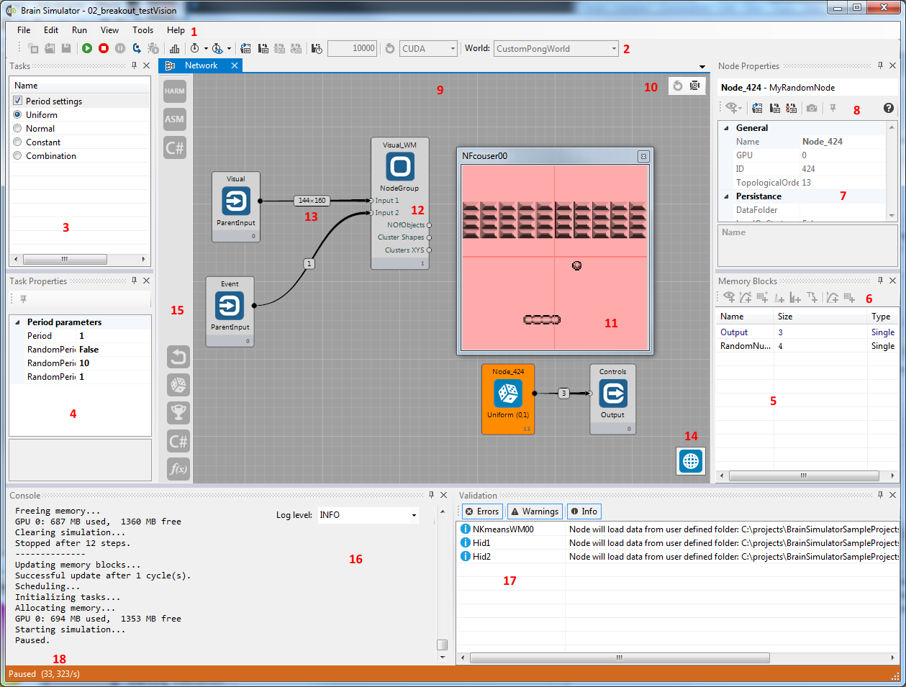
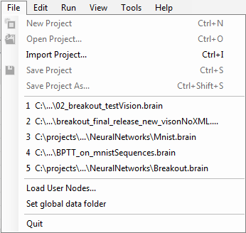
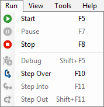
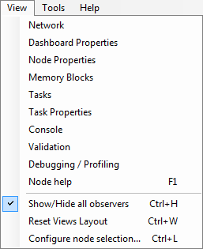

# UI Guide
We tried to keep the UI as simple as possible, you can see the basic controls of Brain Simulator on the following screen-shot.

1. [Menu toolbar](ui.md#menu-toolbar)
2. [Simulation controls](ui.md#simulation-controls)
3. [Node tasks](ui.md#node-tasks)
4. Task parameters
5. Node memory blocks
6. [Observer toolbar](ui.md#observer-toolbar)
7. Node/observer parameters
8. [Node toolbar](ui.md#node-toolbar)
9. Workspace
10. [Workspace controls](ui.md#workspace-controls)
11. Memory block observer window
12. Node group
13. Node connection - shows size of memory block connected
14. World
15. Nodes toolstrip
16. Log window
17. Validator window
18. [Simulation run information](ui.md#simulation-info)

### <a name="menu-toolbar">Menu Toolbar</a>
#### File

* **New Project, CTRL+N** - creates new project
* **Open Project..., CTRL+O** - open a project
* **Import Project..., CTRL+I** - add another project to current workspace
* **Save Project, CTRL+S** - save project
* **Save Project As..., CTRL+SHIFT+S** - save project with dialog
* List of recently opened projects
* **Load User Nodes** - load nodes from custom XML file
* **Quit** - quits Brain Simulator

#### Edit

* **Copy Selection, CTRL+C** - copies currently selected nodes into clipboard
* **Paste Selection, CTRL+V** - paste nodes from clipboard into a workspace

It should be mentioned, that nodes are stored as XML text in a clipboard. Thanks to this, you can e.g. "paste" parts of different projects, just by copying corresponding part of their XML source file into a clipboard.

#### Run

* **Start, F5** - starts or resumes the simulation
* **Pause, F7** - pauses the simulation
* **Stop, F8** - stops the simulation
* **Step Over, F10** - runs the simulation for 1 step

#### View

* **Network, Node Properties, Tasks, Task Properties, Console, Validation** - Opens various Brain Simulator windows (9, 7, 3, 4, 16, 17)
* **Node help, F1** - opens documentation for currently selected node
* **Configure node selection..., CTRL+L** - opens configuration window, where you can choose which nodes should be visible in Nodes toolstrip (15) and which Worlds in Simulation controls (2)

#### Tools

* **Update Memory Blocks, F4** - updates all memory blocks (this is automatically done when starting the simulation)

#### Help

* **Guide..., CTRL+F1** - opens this documentation page

### <a name="simulation-controls">Simulation Controls</a>

Some of these are just shortcuts for menu items. Left to right:

* **New/Open/Save Project**
* **Run/Stop/Pause Simulation**
* **Step Over**
* **Sleep Interval** - after each simulation step, Brain Simulator sleeps for X ms; used for slowing down the simulation
* **Report Interval** - observers are rendered each X ms
*  **Global Load on Start** - toggle; all nodes that have their own persistence data files with the state load them on start of the simulation
*  **Global Save on Stop** - toggle; all nodes save their persistence data on simulation stop
*  **Clear Stored Network State**
*  **Export Stored Network State**
*  **Autosave During Simulation each X steps** - toggle; all nodes save their persistence data on simulation stop
*  **Reload CUDA Kernels** - reloads kernel .PTX files. Can be used for adding kernels to running instance of Brain Simulator
*  **World** - choose a world

### <a name="node-tasks">Node Tasks</a>

The list of tasks of the selected node, you can enable and disable the tasks execution here. This can be done during the simulation.

### <a name="observer-toolbar">Observer Toolbar</a>

You can add Standard, Plot, Matrix, Spike or Histogram observer to memory block here.

### <a name="node-toolbar">Node Toolbar</a>

Left to right:

* **Add Node Observer** - if node has any
* **Load Data on Startup** - toggle; loads node's specific state data on the simulation start
* **Save Data on Stop** - toggle; saves node's specific state data on the simulation stop
* **Autosave Snapshot** - save observer snapshot (as .PNG) to %userprofile%\Documents\bs_snapshots
* **Help, F1** - opens the documentation for the selected node

### <a name="workspace-controls">Workspace Controls</a>

Left to right:

* **Update Memory Blocks** - calls `UpdateMemoryBlocks()` for all nodes. Updates the memory block sizes on connections.
* **Zoom To Fit** - makes all nodes in current node group visible in current viewport

### <a name="simulation-info">Simulation Info</a>

Left to right:

* **Simulation state** - Running/Paused/Design Mode
* **Current simulation step**
* **Speed of simulation** - in steps per second

### Node Group
Node group serves for joining multiple nodes into one topological object, which looks like just one node in the workspace. You can change number of I/O connections of the node group in its node parameters window (7).

To change the contents of the node group, double click on it, and you will see it expanded in the node group workspace. You can switch between multiple workspace windows with the tabs on the top border of the workspace window.

When you are inside a node group workspace, you can rename its I/O connections by clicking on them and changing their name in node parameter window. These names will be visible on the higher level too.

You can insert node groups into node groups how many times you want. You can copy/paste node groups as well.

### Conditional group
Conditional group serves for running a group of node only when a condition is met. The condition is transferred to a conditional group by means of signals. 

Basically, you create a node which emits a signal, add it to your project and then choose the appropriate signal in the conditional group *Misc-Signal* attribute. Then, when the signal is raised, the content of the conditional group is ran.